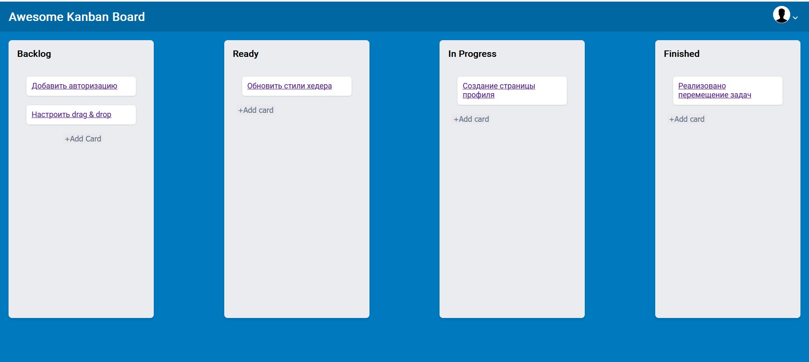

# 🗂️ Kanban Board – React Application

A simple and functional Kanban board built with React. It allows users to manage tasks across four columns: `Backlog`, `Ready`, `In Progress`, and `Finished`.

---

## 📌 Features

- ➕ Add new tasks to the Backlog
- 🔁 Move tasks across workflow stages
- 🔍 View task details via a dedicated route
- 💾 Data is stored in localStorage to persist state
- 🧼 Clean component structure using React Hooks

---

## 🛠 Technologies

- React
- React Router DOM
- useState / useEffect
- Custom CSS
- LocalStorage API

---

## 🚀 Getting Started

```bash
git clone https://github.com/Madina-DI/KanbanBoard.git
cd KanbanBoard
npm install
npm start

## 📸 Preview

 

---

## 🗂 Project Structure

src/
├── components/
│ ├── Header/
│ ├── Footer/
│ ├── TaskList/
│ ├── TaskBoard/
│ └── TaskDetails/
├── data/
│ └── mockData.js
├── App.js
└── index.js

## 🌱 Future Enhancements

- Implement drag-and-drop functionality
- Allow task editing and deletion
- Add user login and authentication
- Sync data with a real backend or Firebase

## 🔗 Live Demo

[Click here to try the app](https://your-live-demo-url.com)
